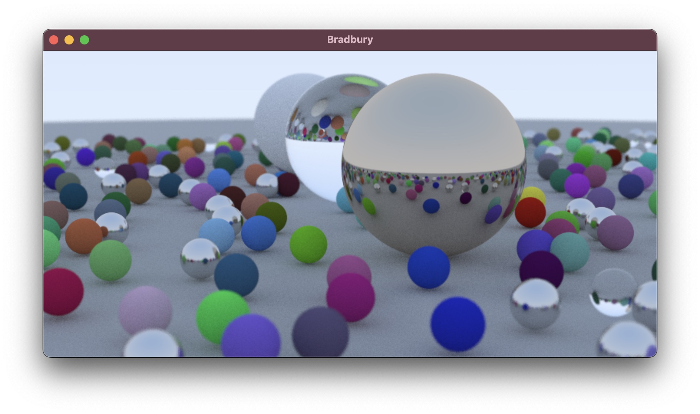

# Bradbury

A simple path tracer for MacOS written in Swift and using Metal Compute, based on the book ["Ray Tracing in One Weekend"](https://github.com/RayTracing/raytracing.github.io) by Peter Shirley. 

Example scene from the final chapter of the book, after about 1 minute on my 2020 M1 MacBook Pro:

